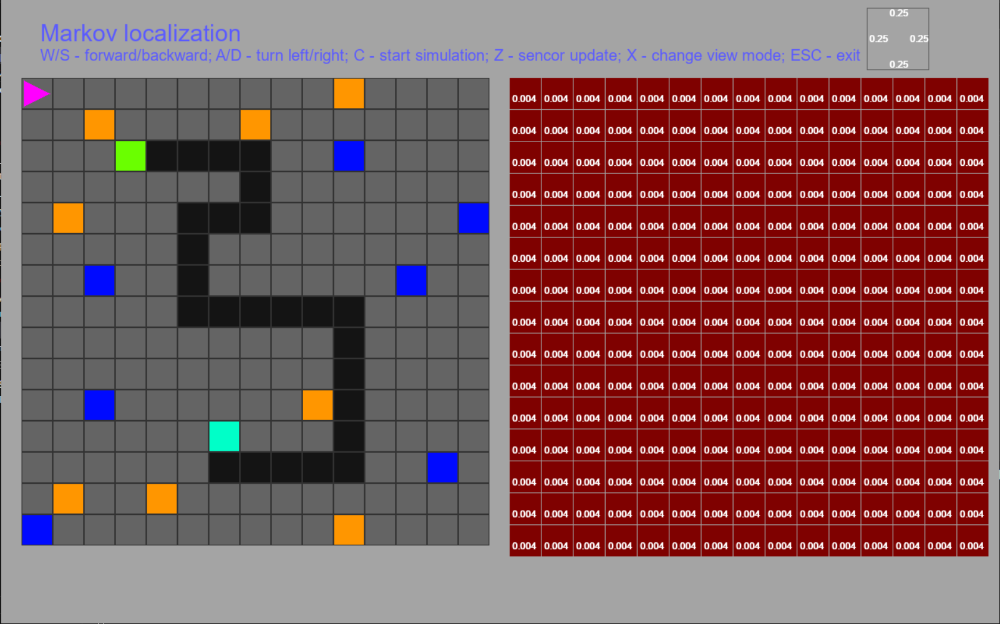

# Markov Localization



Проект по моделированию **Марковской локализации** мобильного робота в дискретной двумерной среде (решётка + цветные маркеры) с неизвестным начальным положением и ориентацией.

---

## 1. Постановка задачи

Рассматривается прямоугольная карта (решётка) размером $N \times M$. Каждая ячейка имеет цвет (номер маркера), по которому робот ориентируется в пространстве.

Робот:
- двигается по клеткам,
- может выходить за границы карты с циклическим переходом (тор),
- имеет дискретную ориентацию: вверх, вправо, вниз, влево,
- считывает цвет текущей клетки шумным сенсором.

Цель: по последовательности действий робота (повороты, шаги) и измерений цвета оценивать:
- карту вероятностей положения робота $S$,
- вероятности ориентаций.

---

## 2. Математическая модель

### 2.1. Сенсорная модель

Пусть $C_{ij}$ — цвет клетки карты $(i,j)$, робот измерил цвет $z$ в текущий момент времени.

Сенсор задаётся вероятностями: $p = p_\text{hit}$ — сенсор правильно показывает цвет, $q = p_\text{miss}$ — сенсор ошибается.

Матрица сенсора $H \in \mathbb{R}^{N \times M}$:
$$H_{ij} = \begin{cases} p, & C_{ij} = z,\\ q, & C_{ij} \neq z. \end{cases}$$

Априорная матрица состояний $S$ (вероятности положения робота по клеткам) обновляется при новом измерении по формуле:
$$\tilde{S} = S \odot H,$$
где $\odot$ — поэлементное (Адамарово) произведение.

Нормализация:
$$S'_{ij} = \frac{\tilde{S}_{ij}}{\sum_{m,n} \tilde{S}_{mn}}.$$

### 2.2. Модель движения

Робот может двигаться вперёд/назад или поворачиваться: `FORWARD`, `BACKWARD`, `TURN_CW`, `TURN_CCW`.

Перемещение по карте моделируется через циклическую перестановку строк/столбцов матрицы $S$ и циклическую свёртку:
$$S^- = S \ast_\text{circ} K,$$
где $\ast_\text{circ}$ — свёртка с круговым дополнением (на торе), $K$ — одномерное или двумерное ядро, задающее стохастику движения.

Полный шаг фильтра:
$$S_t = \text{Normalize}\Big((\text{Move}(S_{t-1})) \odot H_t\Big).$$

### 2.3. Ориентация робота

Ориентация описывается вектором вероятностей:
$$o = (o_\uparrow, o_\rightarrow, o_\downarrow, o_\leftarrow).$$

Для каждой ориентации $k$ можно определить свою матрицу состояний $S^{(k)}$ (например, результат свёртки при движении в этом направлении). Полная матрица состояний:
$$S = \sum_k o_k S^{(k)}.$$

Вектор ориентаций обновляется по результатам специального алгоритма на основе двух цветных клеток:
1. Робот попадает на цветную клетку, запоминает цвет $c_1$.
2. Начиная с этой клетки, записывается список всех действий (движений и поворотов).
3. При попадании на следующую цветную клетку запоминается цвет $c_2$.
4. На карте ищутся все пары клеток $(c_1 \to c_2)$, для каждой симулируется маршрут по записанному списку действий.
5. Из согласованных траекторий собираются возможные ориентации и считается их распределение.
6. Новый вектор $o$ принимается, только если он увеличивает уверенность (даёт большую вероятность, чем текущий).

При поворотах (`TURN_CW`, `TURN_CCW`) вектор ориентаций можно обновлять оператором вида:
$$o' = R o,$$
где $R$ — циклическая матрица перестановки (по сути, оператор поворота ориентаций).

---

## 3. Архитектура и основные классы

Архитектура построена так, чтобы разделить математику и визуализацию.

### 3.1. Вспомогательные функции

- `circular_conv(mat, kernel, is_2d)` — кольцевая (циклическая) свёртка;
- `interpolate_color(t)` — линейная интерполяция цвета для тепловой карты;
- `rotate_matrix(alpha, degree)` — матрица поворота на угол $\alpha$;
- `calc_dist_2d(p1, p2)` — расстояние между точками.

### 3.2. Карты

Абстракция:

- `AbstractMap` — базовый интерфейс карты:
  - `create_grid()`
  - `render_grid(screen)`

Реализации:

- `GridCell` — одна клетка карты (умеет себя отрисовать).
- `ProbabilityMap(AbstractMap)` — карта вероятностей:
  - хранит матрицу $S$,
  - `sensor_update(mat)` — обновление вероятностей.
- `SimulationMap(AbstractMap)` — карта симуляции:
  - чтение карты из файла (`read_map(path)`),
  - получение цвета клетки (`get_color_num`),
  - построение матрицы сенсора по цвету (`create_sensor_mt`).

### 3.3. Ориентация, движения и сенсор

- `RobotOrientation` — перечисление:
  - `Up`, `Down`, `Left`, `Right`.
- `Movement` — перечисление:
  - `FORWARD`, `BACKWARD`, `TURN_CW`, `TURN_CCW`.
- `Sensor` (dataclass):
  - `p_hit`, `p_miss`.

### 3.4. Робот

- `AbstractRobot`:
  - `move(direction_mag, sim_map, prob_map)`
  - `rotate(orient, sim_map, prob_map)`
  - `render(screen)`
- `Robot(AbstractRobot)`:
  - хранит положение $(x, y)$, ориентацию, параметры отрисовки;
  - реализует:
    - движение с обновлением матрицы состояний,
    - поворот с обновлением ориентации,
    - методы:
      - `calc_orient_with_color(sim_map)` — оценка ориентации по двум цветным клеткам,
      - `localization(...)`, `localization2(...)` — локализация при известной/неизвестной ориентации.

---

## 4. Приложение и визуализация

Используется паттерн Singleton для класса `App`:

- `App` создаёт:
  - оконное приложение на `pygame`,
  - карты (симуляции и вероятностей),
  - робота и сенсор.
- Обрабатывает:
  - события клавиатуры и мыши,
  - запуск/остановку локализации,
  - отрисовку всех слоёв (карта, тепловая карта, робот, заголовок).

Взаимодействие с пользователем:
- задание карты (из изображения),
- пошаговое управление роботом (движение, повороты),
- запуск алгоритмов локализации и отображение процесса.

---

## 5. Зависимости и запуск

Используются библиотеки:
- `pygame` — визуализация;
- `numpy` — работа с матрицами и векторами;
- `scipy` — свёртки;
- `cv2` — чтение карты из изображения;

а также стандартные модули Python:
- `abc`, `enum`, `dataclasses`, `typing` и др.

Пример установки и запуска:

```bash
pip install pygame numpy scipy opencv-python

python main.py
```

(Имя файла и точка входа зависят от вашей реализации.)

---

## 6. Идеи для развития

- поддержка других типов решёток (например, гексагональных);
- некольцевые миры, препятствия, более сложные сенсоры;
- автоматическое планирование пути поверх Марковской локализации;
- более строгая модель оценки ориентации на основе длинных цветовых последовательностей и байесовского вывода.
